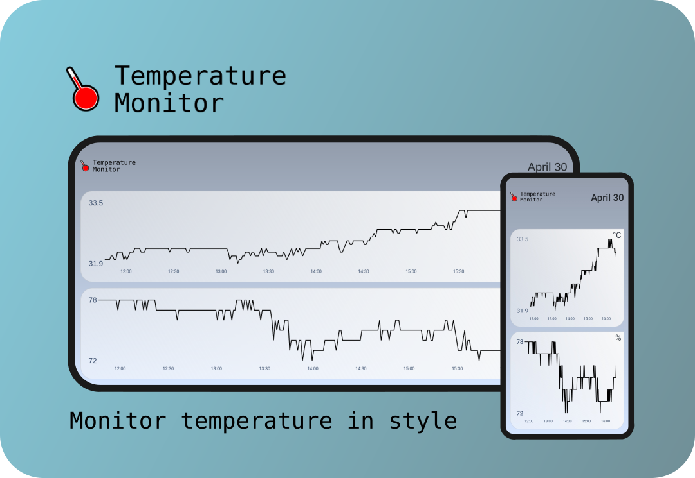
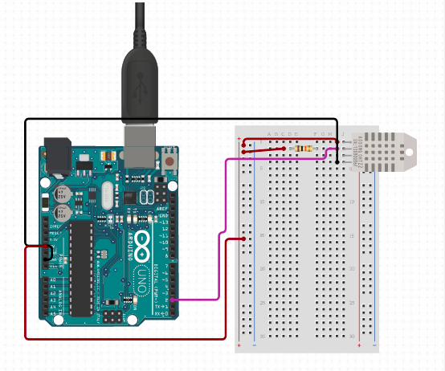

[![MIT License][license-shield]][license-url]
[![LinkedIn][linkedin-shield]][linkedin-url]


<!-- PROJECT LOGO -->
<br />
<p align="center">
  <a href="https://github.com/ammaar8/temperature-monitor">
    
  </a>

  <h3 align="center">Temperature Monitor</h3>

  <p align="center">
    An indoor temperature and humidity monitoring project.
    <br />
    <br />
    <br />
    <a href="https://temperature-monitor.herokuapp.com/">View App</a>
    ·
    <a href="https://github.com/ammaar8/temperature-monitor/issues">Report Bug</a>
    ·
    <a href="https://github.com/ammaar8/temperature-monitor/issues">Request Feature</a>
  </p>
</p>


<!-- TABLE OF CONTENTS -->
<details open="open">
  <summary>Table of Contents</summary>
  <ol>
    <li>
      <a href="#about-the-project">About The Project</a>
      <ul>
        <li><a href="#built-with">Built With</a></li>
      </ul>
    </li>
    <li>
      <a href="#getting-started">Getting Started</a>
      <ul>
        <li><a href="#schematic">Schematic</a></li>
        <li><a href="#arduino">Arduino</a></li>
        <li><a href="#app">App</a></li>
      </ul>
    </li>
    <li><a href="#usage">Usage</a></li>
        <ul>
            <li><a href="#logging">Logging</a></li>
            <li><a href="#deploying">Deploying</a></li>
        </ul>
    <li><a href="#license">License</a></li>
    <li><a href="#contact">Contact</a></li>
    <li><a href="#acknowledgements">Acknowledgements</a></li>
  </ol>
</details>


<!-- ABOUT THE PROJECT -->
## About The Project



This is a hobby project in which sensor data is being published to a heroku database and can be visualized using a dash web app. This project can be repurposed to visualize any type of numeric data from sensors.


### Built With

* [Dash](https://plotly.com/dash/)
* [Heroku](https://heroku.com)
* [Arduino](https://www.arduino.cc/)
* [Pandas](https://pandas.pydata.org/)


<!-- GETTING STARTED -->
## Getting Started

### Prerequisites
To get started with this project you will need:
1. Arduino UNO
2. DHT11 Sensor

### Install
1. Install python requirements
```
pip3 install -r requirement.txt
```
2. Install [Heroku](https://devcenter.heroku.com/articles/heroku-cli)

<!-- SCHEMATIC -->
### Schematic
Build the circuit according to the schematic.


<!-- ARDUINO -->
### Arduino
After completing the hardware part upload [temperature_monitor.ino](arduino/temperature_monitor.ino) to the arduino.
<!-- APP -->
### App


<!-- USAGE EXAMPLES -->
## Usage

<!-- LOGGING DATA -->
### Logging

<!-- DEPLOYING TO HEROKU -->
### Deploying


<!-- CONTRIBUTING -->
## Contributing

Contributions are what make the open source community such an amazing place to be learn, inspire, and create. Any contributions you make are **greatly appreciated**.

1. Fork the Project
2. Create your Feature Branch (`git checkout -b feature/AmazingFeature`)
3. Commit your Changes (`git commit -m 'Add some AmazingFeature'`)
4. Push to the Branch (`git push origin feature/AmazingFeature`)
5. Open a Pull Request


<!-- LICENSE -->
## License

Distributed under the MIT License. See `LICENSE` for more information.


<!-- CONTACT -->
## Contact

Ammaar Solkar - asketch8@gmail.com

Project Link: [https://github.com/ammaar8/temperature-monitor](https://github.com/ammaar8/temperature-monitor)


<!-- ACKNOWLEDGEMENTS -->
## Acknowledgements
* [Readme Template](https://github.com/othneildrew/Best-README-Template/)


<!-- MARKDOWN LINKS & IMAGES -->
<!-- https://www.markdownguide.org/basic-syntax/#reference-style-links -->
[license-shield]: https://img.shields.io/github/license/othneildrew/Best-README-Template.svg?style=for-the-badge
[license-url]: https://github.com/othneildrew/Best-README-Template/blob/master/LICENSE.txt
[linkedin-shield]: https://img.shields.io/badge/-LinkedIn-black.svg?style=for-the-badge&logo=linkedin&colorB=555
[linkedin-url]: https://linkedin.com/in/ammaar-solkar
